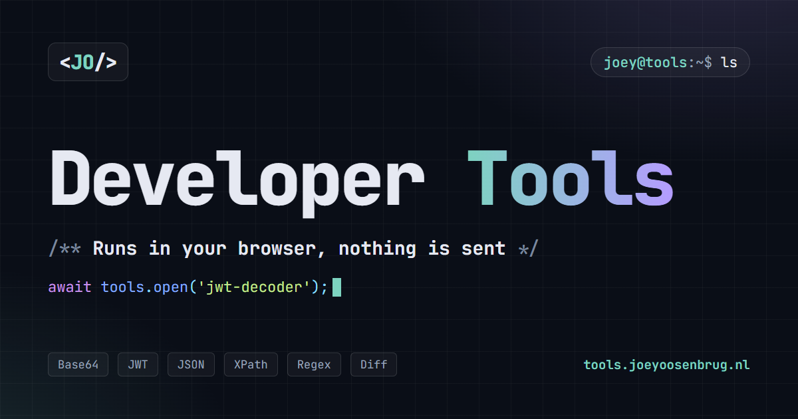

# Joey Oosenbrug · Tools

[](https://tools.joeyoosenbrug.nl)

A dashboard of developer tools: the small tools a developer keeps reaching for, built in-house, plus hand-picked links to the best ones elsewhere. In the style of [joeyoosenbrug.nl](https://joeyoosenbrug.nl).

**Live:** [tools.joeyoosenbrug.nl](https://tools.joeyoosenbrug.nl) · [Nederlands](https://tools.joeyoosenbrug.nl/nl/)

## Principles

1. **What you put into a tool stays in the browser.** Every tool runs client-side. The Content Security Policy lets the page talk to itself and to one other host: the Supabase project behind the optional sign-in, which only ever receives your favourites.
2. **One file per tool, one registry.** Search, cards, routes, tests and translations all follow from the registry.
3. **Useful on day one.** The dashboard was a start page before the last tool was built, and takes a new tool the same way: listed first, built after.

## Status

All 55 tools in `src/lib/tools/registry.ts` are built, each in English and Dutch:

| Category            | Tools                                                                                                                                            |
| ------------------- | ------------------------------------------------------------------------------------------------------------------------------------------------ |
| Encode / decode     | Base64, URL encode / decode, JWT decoder, HTML entities, Unicode inspector, Hex / Base32, String escape                                          |
| Data & formats      | JSON formatter, YAML ↔ JSON, JSON → TypeScript, Diff, CSV viewer, JSONPath tester, SQL formatter, .env ↔ JSON                                    |
| XML                 | XML formatter, XPath tester, XML ↔ JSON                                                                                                          |
| Text                | Regex tester, Case converter, Counter, Lines, Markdown preview, Slug + lorem ipsum                                                               |
| Generate & security | UUID / ULID / NanoID, Password generator, Hash, HMAC, Certificate decoder, QR code, TOTP generator, SRI hash, CSP builder                        |
| Date & time         | Unix timestamp, Cron explainer, Date difference, Timezone planner                                                                                |
| Front-end & CSS     | Colour converter, Contrast checker, clamp() calculator, Gradient + shadow, Cubic-bezier editor, SVG optimiser, Image resizer, Open Graph preview |
| Web & HTTP          | URL parser, curl → fetch, HTTP status + MIME, User-agent parser                                                                                  |
| Dev reference       | This browser, Calculators (number bases, chmod, data sizes, CIDR, semver)                                                                        |
| Dutch test data     | BSN, IBAN and postcode: check and generate                                                                                                       |
| Team                | Planning poker, Timebox timer, Random picker                                                                                                     |

A tool is a folder in `src/lib/tools/<slug>/` with `Tool.svelte`, `text.ts`, `logic.ts` and `logic.test.ts`, a test in `e2e/tools/<slug>.spec.ts`, and one line in the registry. A tool that is in the registry without that line is listed as coming soon.

You can star tools; the favourites are pinned at the top. They live in your browser, and sync across devices if you sign in with Google ([how that works](docs/favorites.md)).

## Stack

SvelteKit 2 + Svelte 5, TypeScript (strict), `adapter-static`, Vitest, Playwright + axe, Lighthouse CI, ESLint + Prettier, GitHub Actions → GitHub Pages. Node 24.

The look comes from the portfolio's design kit, copied into `src/lib/jo/`. Change it in the [portfolio](https://github.com/joeykwispel/Portfolio/tree/main/docs/design-kit) first, then copy it here.

## Develop

```sh
npm install
npm run dev          # http://localhost:5173
npm run build        # static site in dist/
npm run preview      # serves dist/ the way GitHub Pages does
```

| Script              | What it does                                                   |
| ------------------- | -------------------------------------------------------------- |
| `npm run lint`      | Prettier + ESLint                                              |
| `npm run check`     | Type check (svelte-check)                                      |
| `npm run test:unit` | Vitest                                                         |
| `npm run test:e2e`  | Playwright + axe on the build, desktop and mobile, both themes |
| `npm run og`        | Regenerates static/og.png (share image and README banner)      |

The end-to-end tests run against `dist/`, so build first. `PW_CHANNEL=chrome npm run test:e2e` uses an installed Chrome instead of Playwright's download.

## Workflow

Feature branch → pull request into `main` → checks (lint, types, unit, end-to-end + accessibility, Lighthouse) → merge → automatic deploy to GitHub Pages. `main` is never pushed to directly.

## License

MIT, see [LICENSE](LICENSE). Third-party material is listed in [static/THIRD-PARTY-NOTICES.txt](static/THIRD-PARTY-NOTICES.txt).
